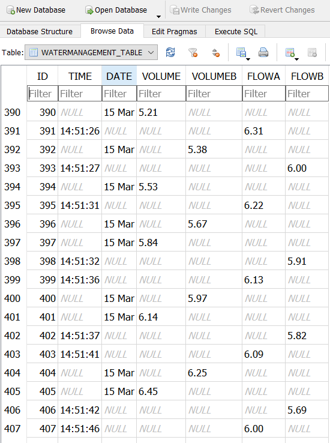
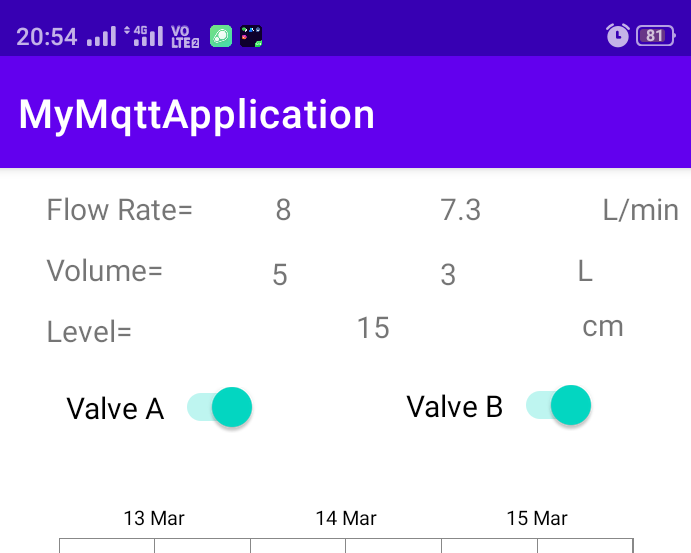
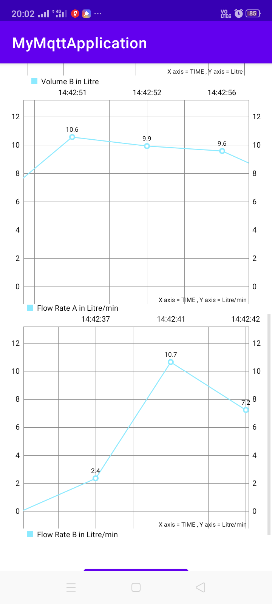
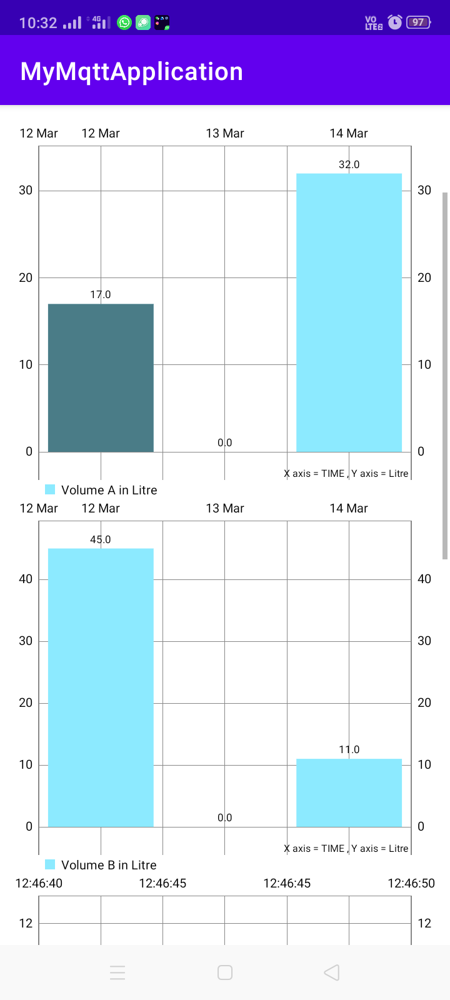
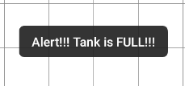

### An Android App using MQTT, SQLite, Java Services and Chart

This app uses the hivemq public broker for MQTT (and paho mqtt library for java), SQLite to store the data locally on device and display the the history using charts on the app.

This App executes MQTT communication with ESP8266 Mqtt client, find the source code here [mqtt_water_management_implementation_on_esp8266](https://github.com/kundan21099/mqtt_water_management_implementation_on_esp8266)

***Stored Database using SQLite Example***

***App Screenshots***

Note: As this app was developed in 2021 and Google ended Android Things support in 2022, this app might not work in newer version and with Android Things dependency. 
